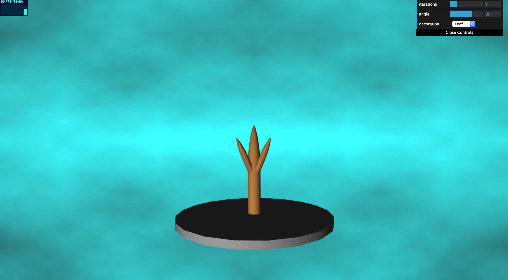
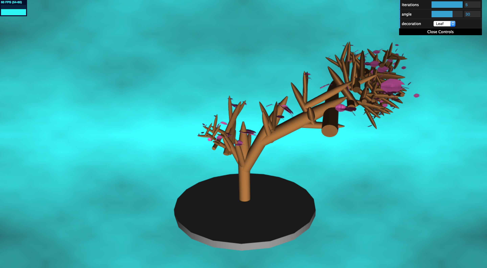
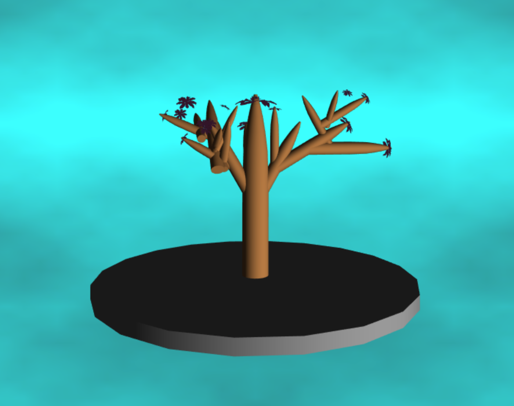
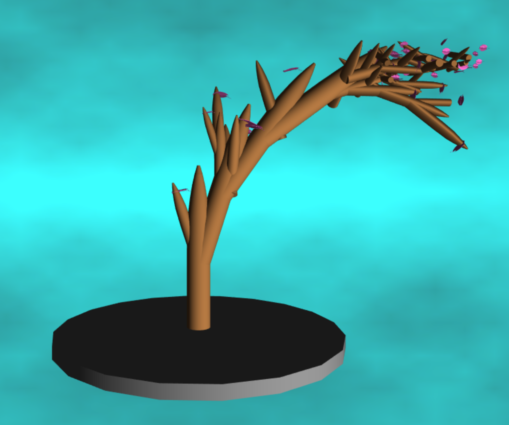

# Homework 4: L-systems

Name: Gizem Dal

Pennkey: gizemdal

Live demo: 

Resources:
I mostly got help from course resources such as Piazza, office hours & lecture notes. I refactored some Fractal Brownian Motion code I had from previous projects. Some other resources are listed as the following:
- I got my function getRandomInt() to generate randomness in grammar expansion from https://developer.mozilla.org/en-US/docs/Web/JavaScript/Reference/Global_Objects/Math/random. 
- The website http://interactivepython.org/runestone/static/CS152f17/Strings/TurtlesandStringsandLSystems.html was very helpful for understanding the L-Systems.
- I got my flower and leaf OBJ files online from the websites: https://people.sc.fsu.edu/~jburkardt/data/obj/magnolia.obj, https://www.cgtrader.com/free-3d-models/plant/leaf/tree-leaf

## Project Aim (taken from the original README):

For this project, I designed a set of formal grammar rules to create a plant life using an L-system program. I implemented a set of classes to handle the L-system grammar expansion and drawing.

## Features & Techniques:

- Set of L-System Classes: I implemented classes such as Turtle, ExpansionRule and DrawingRule to represent my L-System. I use a Turtle instance to represent the location where geometry is drawn, ExpansionRule instance to set rules for grammar expansion with randomness and DrawingRule instance to execute several drawing methods with randomness.

- Instanced Rendering: Instead of filling up the Vertex Buffer Objects for position, normal, etc. for all of the repetitive geometry I'm drawing, I used instanced rendering by passing the appropriate transformations to the shader and apply those transformations to my initial geometry to create transformed instances.

- Background: The background pattern is generated by the use of noise functions and Fractal Brownian Motion.

- Plant growth: The generated plant grows along all 3 dimensions, where organic variation is achieved by randomness. The way randomness is used for expansion and drawing rules is storing multiple expansion and drawing choices for each character, and picking a random one among the possible options by using Math.random().

- Decorations: There are two possible tree decorations that appear on branches: flowers and leafs. The dat.GUI menu contains a drop down menu for decoration where you can pick what decoration to show up on branches (it may be necessary to increment the number of iterations to observe these decorations).

- Iterations & angles: The dat.GUI menu allows you to pick an iteration level as well as an angle of rotation for the branches, which alters the expansion width of the tree.

- Geometry: I modeled the branch and cylinder (the platform where the tree grows) by using Autodesk Maya and exported the obj files to create my meshes (the objFileLoader code was provided by the instructors). I made use of some other obj files corresponding to the flower and leaf, which I downloaded online as I mentioned above.

## Images:

L-System Plant Generator

After a couple iterations

Plant made from flowers

Plant made from leafs

